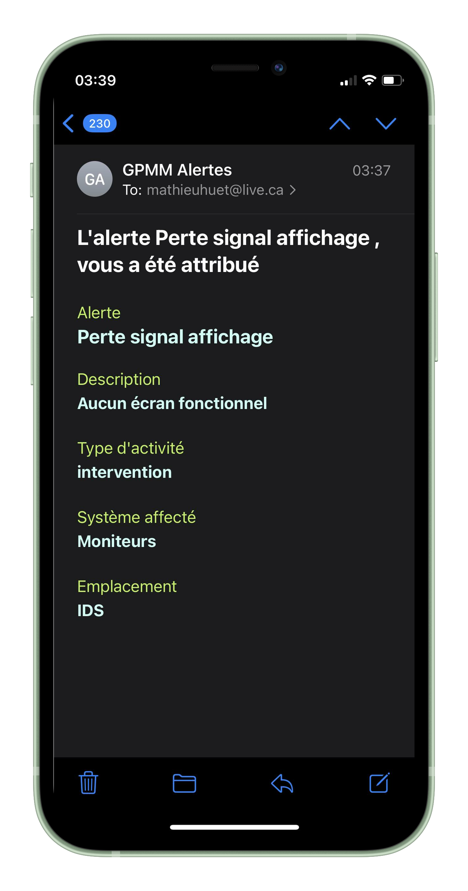

# Server for GPMM_Alertes

Server handling all the back-end work, sending emails, verifying users, fetching data and modifying/adding data.

## Getting Started

To install the required dependencies, you're gonna run `npm install` at the root of this repository

Start the server with `npx nodemon index.js`

You need to create a `secret.js` file at the root of the project that export these variables : `MONGODB_USER_URI` `MONGODB_ACTIVITY_URI` `MONGODB_SITE_URI` `PORT` `AUTH_EMAIL` `AUTH_EMAIL_PASSWORD` `SECRET_KEY`

## Tech Stack
Javascript
MongoDB
Mongoose
Express.js

## Screenshot

Exemple of an email sent by the server, this email show a job assigned to a user.

